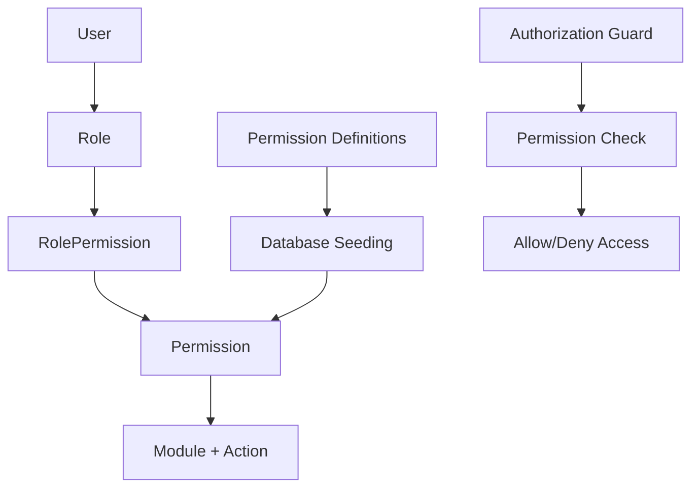

# Design Document

## Overview

The permissions system will implement a comprehensive Role-Based Access Control (RBAC) mechanism for the HR management application. The system will provide granular control over user access to different modules and actions, ensuring that users can only perform operations they are authorized for.

The design leverages the existing Prisma schema structure with the Permission, Role, and RolePermission models, and extends it with a comprehensive set of predefined permissions covering all application modules.

## Architecture

The permissions system follows a three-tier architecture:

1. **Permission Definition Layer**: Static definitions of all available permissions
2. **Role Management Layer**: Dynamic assignment of permissions to roles
3. **Authorization Layer**: Runtime permission checking and enforcement



## Components and Interfaces

### Permission Definition Structure

Each permission follows a standardized structure:

```typescript
interface PermissionDefinition {
  name: string;        // Format: "module.action"
  module: string;      // Module name (e.g., "employee", "department")
  action: string;      // Action name (e.g., "create", "read", "update")
  description: string; // Human-readable description
}
```

### Module Categories

The system organizes permissions into logical module categories:

1. **Master Data Modules**: Reference data management
2. **HR Management Modules**: Core HR operations
3. **Financial Modules**: Financial and payroll operations
4. **Administrative Modules**: System administration
5. **Policy Modules**: Organizational policies
6. **Reporting Modules**: Reports and analytics

### Action Types

Standard actions across all modules:
- `create`: Create new records
- `read`: View/list records
- `update`: Modify existing records
- `delete`: Remove records
- `bulk_create`: Create multiple records
- `bulk_update`: Update multiple records
- `bulk_delete`: Delete multiple records

Specialized actions for specific modules:
- `approve`: Approve requests/applications
- `import`: Import data from files
- `export`: Export data to files
- `assign`: Assign policies or configurations
- `manage`: Complex management operations
- `view_summary`: View aggregated data
- `generate`: Generate reports or payroll
- `rejoin`: Employee rejoining operations

## Data Models

The system uses the existing Prisma schema models:

### Permission Model
```prisma
model Permission {
  id          String           @id @default(uuid())
  name        String           @unique
  module      String
  action      String
  description String?
  createdAt   DateTime         @default(now())
  roles       RolePermission[]
}
```

### Role Model
```prisma
model Role {
  id          String           @id @default(uuid())
  name        String           @unique
  description String?
  isSystem    Boolean          @default(false)
  createdAt   DateTime         @default(now())
  updatedAt   DateTime         @updatedAt
  permissions RolePermission[]
  users       User[]
}
```

### RolePermission Model
```prisma
model RolePermission {
  id           String     @id @default(uuid())
  roleId       String
  permissionId String
  permission   Permission @relation(fields: [permissionId], references: [id], onDelete: Cascade)
  role         Role       @relation(fields: [roleId], references: [id], onDelete: Cascade)

  @@unique([roleId, permissionId])
}
```

## Permission Categories and Definitions

### Master Data Permissions

**Allocation Module**
- `allocation.create`: Create new allocations
- `allocation.read`: View allocation list and details
- `allocation.update`: Update allocation information
- `allocation.delete`: Delete allocations
- `allocation.bulk_create`: Create multiple allocations
- `allocation.bulk_update`: Update multiple allocations
- `allocation.bulk_delete`: Delete multiple allocations

**Department Module**
- `department.create`: Create new departments
- `department.read`: View department list and details
- `department.update`: Update department information
- `department.delete`: Delete departments
- `department.bulk_create`: Create multiple departments
- `department.bulk_update`: Update multiple departments
- `department.bulk_delete`: Delete multiple departments

**Sub-Department Module**
- `sub_department.create`: Create new sub-departments
- `sub_department.read`: View sub-department list and details
- `sub_department.update`: Update sub-department information
- `sub_department.delete`: Delete sub-departments
- `sub_department.bulk_create`: Create multiple sub-departments
- `sub_department.bulk_update`: Update multiple sub-departments
- `sub_department.bulk_delete`: Delete multiple sub-departments

**Employee Grade Module**
- `employee_grade.create`: Create new employee grades
- `employee_grade.read`: View employee grade list and details
- `employee_grade.update`: Update employee grade information
- `employee_grade.delete`: Delete employee grades
- `employee_grade.bulk_create`: Create multiple employee grades
- `employee_grade.bulk_update`: Update multiple employee grades
- `employee_grade.bulk_delete`: Delete multiple employee grades

**Designation Module**
- `designation.create`: Create new designations
- `designation.read`: View designation list and details
- `designation.update`: Update designation information
- `designation.delete`: Delete designations
- `designation.bulk_create`: Create multiple designations
- `designation.bulk_update`: Update multiple designations
- `designation.bulk_delete`: Delete multiple designations

**Location Module**
- `location.create`: Create new locations
- `location.read`: View location list and details
- `location.update`: Update location information
- `location.delete`: Delete locations
- `location.bulk_create`: Create multiple locations
- `location.bulk_update`: Update multiple locations
- `location.bulk_delete`: Delete multiple locations

**Bank Module**
- `bank.create`: Create new banks
- `bank.read`: View bank list and details
- `bank.update`: Update bank information
- `bank.delete`: Delete banks
- `bank.bulk_create`: Create multiple banks
- `bank.bulk_update`: Update multiple banks
- `bank.bulk_delete`: Delete multiple banks

**City Module**
- `city.create`: Create new cities
- `city.read`: View city list and details
- `city.update`: Update city information
- `city.delete`: Delete cities
- `city.bulk_create`: Create multiple cities
- `city.bulk_update`: Update multiple cities
- `city.bulk_delete`: Delete multiple cities

**Qualification Module**
- `qualification.create`: Create new qualifications
- `qualification.read`: View qualification list and details
- `qualification.update`: Update qualification information
- `qualification.delete`: Delete qualifications
- `qualification.bulk_create`: Create multiple qualifications
- `qualification.bulk_update`: Update multiple qualifications
- `qualification.bulk_delete`: Delete multiple qualifications

**Institute Module**
- `institute.create`: Create new institutes
- `institute.read`: View institute list and details
- `institute.update`: Update institute information
- `institute.delete`: Delete institutes
- `institute.bulk_create`: Create multiple institutes
- `institute.bulk_update`: Update multiple institutes
- `institute.bulk_delete`: Delete multiple institutes

**Equipment Module**
- `equipment.create`: Create new equipment
- `equipment.read`: View equipment list and details
- `equipment.update`: Update equipment information
- `equipment.delete`: Delete equipment
- `equipment.bulk_create`: Create multiple equipment
- `equipment.bulk_update`: Update multiple equipment
- `equipment.bulk_delete`: Delete multiple equipment
- `equipment.assign`: Assign equipment to employees
- `equipment.return`: Process equipment returns

**Job Type Module**
- `job_type.create`: Create new job types
- `job_type.read`: View job type list and details
- `job_type.update`: Update job type information
- `job_type.delete`: Delete job types
- `job_type.bulk_create`: Create multiple job types
- `job_type.bulk_update`: Update multiple job types
- `job_type.bulk_delete`: Delete multiple job types

**Employee Status Module**
- `employee_status.create`: Create new employee statuses
- `employee_status.read`: View employee status list and details
- `employee_status.update`: Update employee status information
- `employee_status.delete`: Delete employee statuses
- `employee_status.bulk_create`: Create multiple employee statuses
- `employee_status.bulk_update`: Update multiple employee statuses
- `employee_status.bulk_delete`: Delete multiple employee statuses

**Marital Status Module**
- `marital_status.create`: Create new marital statuses
- `marital_status.read`: View marital status list and details
- `marital_status.update`: Update marital status information
- `marital_status.delete`: Delete marital statuses
- `marital_status.bulk_create`: Create multiple marital statuses
- `marital_status.bulk_update`: Update multiple marital statuses
- `marital_status.bulk_delete`: Delete multiple marital statuses

### HR Management Permissions

**Employee Module**
- `employee.create`: Create new employees
- `employee.read`: View employee list and details
- `employee.update`: Update employee information
- `employee.delete`: Delete employees
- `employee.import`: Import employees from CSV/Excel
- `employee.export`: Export employee data
- `employee.rejoin`: Process employee rejoining
- `employee.view_history`: View employee rejoining history
- `employee.view_dropdown`: View employees for dropdown selection
- `employee.view_attendance`: View employees for attendance management

**Attendance Module**
- `attendance.create`: Create attendance records
- `attendance.read`: View attendance records
- `attendance.update`: Update attendance records
- `attendance.delete`: Delete attendance records
- `attendance.manage`: Manage attendance for multiple employees
- `attendance.view_summary`: View attendance summary reports
- `attendance.request`: Create attendance requests
- `attendance.approve_request`: Approve attendance requests
- `attendance.exemption`: Create attendance exemptions
- `attendance.manage_exemption`: Manage attendance exemptions

**Leave Module**
- `leave.create`: Create leave applications
- `leave.read`: View leave applications
- `leave.update`: Update leave applications
- `leave.delete`: Delete leave applications
- `leave.approve`: Approve leave applications
- `leave.reject`: Reject leave applications
- `leave.encash`: Process leave encashment
- `leave.approve_encashment`: Approve leave encashment

**Leave Type Module**
- `leave_type.create`: Create new leave types
- `leave_type.read`: View leave type list and details
- `leave_type.update`: Update leave type information
- `leave_type.delete`: Delete leave types
- `leave_type.bulk_create`: Create multiple leave types
- `leave_type.bulk_update`: Update multiple leave types
- `leave_type.bulk_delete`: Delete multiple leave types

**Payroll Module**
- `payroll.create`: Create payroll records
- `payroll.read`: View payroll records
- `payroll.update`: Update payroll records
- `payroll.delete`: Delete payroll records
- `payroll.generate`: Generate payroll for employees
- `payroll.approve`: Approve payroll records
- `payroll.export`: Export payroll data

**Bonus Module**
- `bonus.create`: Create bonus records
- `bonus.read`: View bonus records
- `bonus.update`: Update bonus records
- `bonus.delete`: Delete bonus records
- `bonus.approve`: Approve bonus payments

**Bonus Type Module**
- `bonus_type.create`: Create new bonus types
- `bonus_type.read`: View bonus type list and details
- `bonus_type.update`: Update bonus type information
- `bonus_type.delete`: Delete bonus types
- `bonus_type.bulk_create`: Create multiple bonus types
- `bonus_type.bulk_update`: Update multiple bonus types
- `bonus_type.bulk_delete`: Delete multiple bonus types

**Allowance Module**
- `allowance.create`: Create allowance records
- `allowance.read`: View allowance records
- `allowance.update`: Update allowance records
- `allowance.delete`: Delete allowance records
- `allowance.approve`: Approve allowance payments

**Allowance Head Module**
- `allowance_head.create`: Create new allowance heads
- `allowance_head.read`: View allowance head list and details
- `allowance_head.update`: Update allowance head information
- `allowance_head.delete`: Delete allowance heads
- `allowance_head.bulk_create`: Create multiple allowance heads
- `allowance_head.bulk_update`: Update multiple allowance heads
- `allowance_head.bulk_delete`: Delete multiple allowance heads

**Deduction Module**
- `deduction.create`: Create deduction records
- `deduction.read`: View deduction records
- `deduction.update`: Update deduction records
- `deduction.delete`: Delete deduction records
- `deduction.approve`: Approve deduction amounts

**Deduction Head Module**
- `deduction_head.create`: Create new deduction heads
- `deduction_head.read`: View deduction head list and details
- `deduction_head.update`: Update deduction head information
- `deduction_head.delete`: Delete deduction heads
- `deduction_head.bulk_create`: Create multiple deduction heads
- `deduction_head.bulk_update`: Update multiple deduction heads
- `deduction_head.bulk_delete`: Delete multiple deduction heads

**Loan Request Module**
- `loan_request.create`: Create loan requests
- `loan_request.read`: View loan requests
- `loan_request.update`: Update loan requests
- `loan_request.delete`: Delete loan requests
- `loan_request.approve`: Approve loan requests
- `loan_request.reject`: Reject loan requests
- `loan_request.view_report`: View loan reports

**Loan Type Module**
- `loan_type.create`: Create new loan types
- `loan_type.read`: View loan type list and details
- `loan_type.update`: Update loan type information
- `loan_type.delete`: Delete loan types
- `loan_type.bulk_create`: Create multiple loan types
- `loan_type.bulk_update`: Update multiple loan types
- `loan_type.bulk_delete`: Delete multiple loan types

**Overtime Request Module**
- `overtime_request.create`: Create overtime requests
- `overtime_request.read`: View overtime requests
- `overtime_request.update`: Update overtime requests
- `overtime_request.delete`: Delete overtime requests
- `overtime_request.approve`: Approve overtime requests
- `overtime_request.reject`: Reject overtime requests

**Increment Module**
- `increment.create`: Create increment records
- `increment.read`: View increment records
- `increment.update`: Update increment records
- `increment.delete`: Delete increment records
- `increment.approve`: Approve increment amounts

### Financial Permissions

**Advance Salary Module**
- `advance_salary.create`: Create advance salary requests
- `advance_salary.read`: View advance salary requests
- `advance_salary.update`: Update advance salary requests
- `advance_salary.delete`: Delete advance salary requests
- `advance_salary.approve`: Approve advance salary requests
- `advance_salary.reject`: Reject advance salary requests

**Provident Fund Module**
- `provident_fund.create`: Create PF records
- `provident_fund.read`: View PF records
- `provident_fund.update`: Update PF records
- `provident_fund.delete`: Delete PF records
- `provident_fund.withdraw`: Process PF withdrawals
- `provident_fund.approve_withdrawal`: Approve PF withdrawals

**EOBI Module**
- `eobi.create`: Create EOBI records
- `eobi.read`: View EOBI records
- `eobi.update`: Update EOBI records
- `eobi.delete`: Delete EOBI records
- `eobi.bulk_create`: Create multiple EOBI records
- `eobi.bulk_update`: Update multiple EOBI records
- `eobi.bulk_delete`: Delete multiple EOBI records

**Social Security Module**
- `social_security.create`: Create social security records
- `social_security.read`: View social security records
- `social_security.update`: Update social security records
- `social_security.delete`: Delete social security records
- `social_security.register_employee`: Register employee for social security
- `social_security.register_employer`: Register employer for social security

**Tax Slab Module**
- `tax_slab.create`: Create new tax slabs
- `tax_slab.read`: View tax slab list and details
- `tax_slab.update`: Update tax slab information
- `tax_slab.delete`: Delete tax slabs
- `tax_slab.bulk_create`: Create multiple tax slabs
- `tax_slab.bulk_update`: Update multiple tax slabs
- `tax_slab.bulk_delete`: Delete multiple tax slabs

**Rebate Module**
- `rebate.create`: Create rebate records
- `rebate.read`: View rebate records
- `rebate.update`: Update rebate records
- `rebate.delete`: Delete rebate records
- `rebate.approve`: Approve rebate amounts

**Rebate Nature Module**
- `rebate_nature.create`: Create new rebate natures
- `rebate_nature.read`: View rebate nature list and details
- `rebate_nature.update`: Update rebate nature information
- `rebate_nature.delete`: Delete rebate natures
- `rebate_nature.bulk_create`: Create multiple rebate natures
- `rebate_nature.bulk_update`: Update multiple rebate natures
- `rebate_nature.bulk_delete`: Delete multiple rebate natures

**Salary Breakup Module**
- `salary_breakup.create`: Create new salary breakups
- `salary_breakup.read`: View salary breakup list and details
- `salary_breakup.update`: Update salary breakup information
- `salary_breakup.delete`: Delete salary breakups
- `salary_breakup.bulk_create`: Create multiple salary breakups
- `salary_breakup.bulk_update`: Update multiple salary breakups
- `salary_breakup.bulk_delete`: Delete multiple salary breakups

### Administrative Permissions

**User Management Module**
- `user.create`: Create new users
- `user.read`: View user list and details
- `user.update`: Update user information
- `user.delete`: Delete users
- `user.reset_password`: Reset user passwords
- `user.lock`: Lock user accounts
- `user.unlock`: Unlock user accounts
- `user.assign_role`: Assign roles to users

**Role Management Module**
- `role.create`: Create new roles
- `role.read`: View role list and details
- `role.update`: Update role information
- `role.delete`: Delete roles
- `role.assign_permissions`: Assign permissions to roles
- `role.view_permissions`: View role permissions

**Activity Log Module**
- `activity_log.read`: View activity logs
- `activity_log.export`: Export activity logs
- `activity_log.delete`: Delete activity logs

**System Configuration Module**
- `system_config.read`: View system configuration
- `system_config.update`: Update system configuration

**Holiday Module**
- `holiday.create`: Create new holidays
- `holiday.read`: View holiday list and details
- `holiday.update`: Update holiday information
- `holiday.delete`: Delete holidays
- `holiday.bulk_create`: Create multiple holidays
- `holiday.bulk_update`: Update multiple holidays
- `holiday.bulk_delete`: Delete multiple holidays

**Request Forwarding Module**
- `request_forwarding.create`: Create forwarding configurations
- `request_forwarding.read`: View forwarding configurations
- `request_forwarding.update`: Update forwarding configurations
- `request_forwarding.delete`: Delete forwarding configurations

**Exit Clearance Module**
- `exit_clearance.create`: Create exit clearance records
- `exit_clearance.read`: View exit clearance records
- `exit_clearance.update`: Update exit clearance records
- `exit_clearance.delete`: Delete exit clearance records
- `exit_clearance.approve`: Approve exit clearance

### Policy Permissions

**Leave Policy Module**
- `leave_policy.create`: Create leave policies
- `leave_policy.read`: View leave policies
- `leave_policy.update`: Update leave policies
- `leave_policy.delete`: Delete leave policies
- `leave_policy.assign`: Assign leave policies to employees
- `leave_policy.manual_leaves`: Manage manual leave assignments

**Working Hours Policy Module**
- `working_hours_policy.create`: Create working hours policies
- `working_hours_policy.read`: View working hours policies
- `working_hours_policy.update`: Update working hours policies
- `working_hours_policy.delete`: Delete working hours policies
- `working_hours_policy.assign`: Assign working hours policies to employees

### Reporting Permissions

**Reports Module**
- `reports.attendance`: View attendance reports
- `reports.payroll`: View payroll reports
- `reports.employee`: View employee reports
- `reports.leave`: View leave reports
- `reports.financial`: View financial reports
- `reports.loan`: View loan reports
- `reports.export`: Export all reports

## Error Handling

The system implements comprehensive error handling for permission-related operations:

1. **Permission Not Found**: When a requested permission doesn't exist
2. **Access Denied**: When a user lacks required permissions
3. **Role Assignment Errors**: When role-permission assignments fail
4. **Database Constraint Violations**: When permission constraints are violated
5. **Authentication Failures**: When user authentication fails

Error responses follow a consistent format:
```typescript
interface PermissionError {
  code: string;
  message: string;
  details?: any;
  timestamp: Date;
}
```

## Testing Strategy

The testing approach combines unit tests for specific functionality and property-based tests for comprehensive validation.

### Unit Testing
- Test specific permission validation scenarios
- Test role-permission assignment operations
- Test error handling for various failure cases
- Test database seeding and initialization
- Test permission caching mechanisms

### Property-Based Testing
Property-based tests will validate universal properties across all permission operations using a suitable testing framework for TypeScript/JavaScript such as fast-check.

Each property test will run a minimum of 100 iterations to ensure comprehensive coverage through randomization.