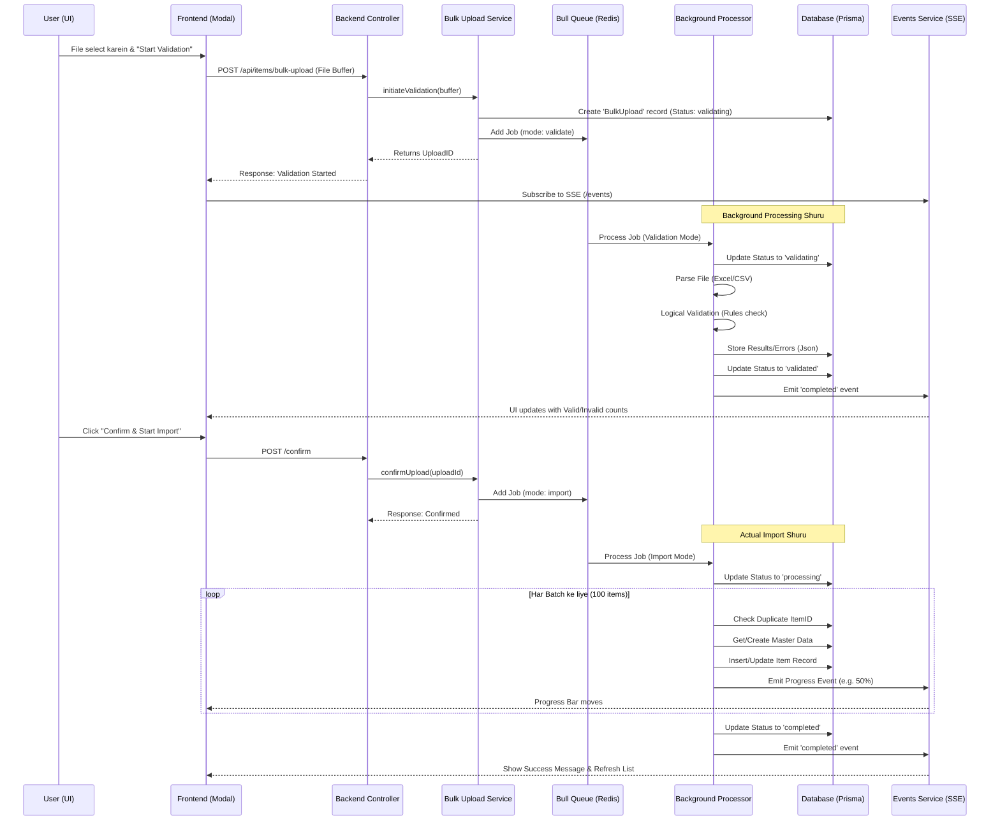

# ERP Items Bulk Upload Complete Flow

Is document mein ERP Items Bulk Upload ka mukammal tareeqa (flow) Roman Urdu mein samjhaya gaya hai.

### Phase 1: File Preparation aur Upload
1. **Template Download Karein**: Sab se pehle "Bulk Upload" modal mein ja kar Excel ya CSV template download karein taake aapka data system ke mutabiq ho.
2. **File Select Karein**: Apni tayyar karda file (CSV ya Excel) ko select karein.
3. **Start Validation**: "Start Validation" button par click karein. Is step mein system sirf aapka data check karta hai, database mein save nahi karta.

### Phase 2: Validation (Data Ki Checking)
1. **Smart Scanning**: System har row ko check karta hai ke formats theek hain ya nahi aur koi duplicate Item ID toh nahi.
2. **Result Review**: 
   - Agar sab theek hai, toh stats mein "Valid" rows nazar ayengi.
   - Agar koi error hai, toh system aapko row number aur waja (reason) batayega (e.g., "ItemID already exists").
   - Aap error report download kar ke dekh sakte hain ke kahan galti hai.

### Phase 3: Confirmation aur Import
1. **Confirm Import**: Jab aap validation se satisfy hon, toh "Confirm & Start Import" button par click karein.
2. **Real-time Progress**: System batches mein data process karta hai aur aapko real-time mein batata hai ke kitne records import ho chuke hain.
3. **Master Data Handling**: Import ke dauran system khud hi "Brand", "Category", "Class" waghaira ko detect kar ke link kar deta hai. Agar koi nayi "Brand" ho toh usey create bhi kar deta hai.

### Phase 4: Completion
1. **Completed Status**: Jab progress 100% ho jaye, toh status "Completed" ho jayega.
2. **Refresh List**: Items ki list auto-refresh ho jayegi aur aap naye items dekh sakenge.

---

## Kon Kon Si Files Mein Kaam Hua Hai? (File List)

Is flow ko chalane ke liye backend aur frontend ki in files mein kaam kiya gaya hai:

### Backend (nestjs_backend)
1.  **`item-bulk-upload.controller.ts`**: API endpoints define karta hai (Upload, Confirm, SSE Progress).
2.  **`item-bulk-upload.service.ts`**: Business logic aur Bull Jobs ko manage karta hai.
3.  **`upload.processor.ts`**: Background job handler jo asal mein processing karta hai.
4.  **`csv-parser.service.ts`**: CSV aur Excel files ko read karne ki logic.
5.  **`item-validator.service.ts`**: Data validation ke technical rules yahan likhay hain.
6.  **`master-data.service.ts`**: Brands, Categories waghaira ko create/find karta hai.
7.  **`upload-events.service.ts`**: Real-time progress events bhejne ke liye.

### Frontend (frontend)
1.  **`bulk-upload-modal.tsx`**: Files upload karne ka main UI component.
2.  **`use-upload-progress.ts`**: Background progress ko monitor karne wala custom hook.
3.  **`item-list.tsx`**: Jahan se "Bulk Upload" ka button dabaya jata hai.

---

## Technical Validation Kaise Ho Rahi Hai?

Validation do (2) stages mein hoti hai:

### 1. File Level Validation (`item-validator.service.ts`)
Asal processing se pehle, system file ki har row ko in rules pe check karta hai:
- **Required Fields**: Kya SKU, ItemID aur UnitPrice mojud hain?
- **Data Types**: Kya Price aur Tax Rate valid numbers hain? (e.g. Tax 0-100 ke darmayan hona chahiye).
- **Length**: Kya description ya barcode database ki limit se bade toh nahi?
- **File Duplicates**: Kya file ke andar hi ek hi ItemID do baar toh nahi likha hua?

### 2. Database Level Validation (`upload.processor.ts`)
Jab actual import shuru hota hai, toh system database mein check karta hai:
- **Existing Item**: Agar file ka ItemID pehle se database mein mojud hai, toh system us row ko "Duplicate Error" de kar skip kar deta hai taake data corrupt na ho.
- **Master Data Consistency**: Har row ke liye system check karta hai ke kya uska Brand ya Category valid hai, aur agar zarurat ho toh dynamically naye entries create karta hai.

---

## Streaming Aur Real-time Updates (SSE)

Ji haan, is system mein **SSE (Server-Sent Events)** ke zariye "Streaming" ka istemal kiya gaya hai:

### Yeh Kyun Zaroori Hai?
Bulk upload mein jab hazaron rows process hoti hain, toh normal API request bohot der tak "pending" rehti hai aur aksar timeout ho jati hai. Streaming (SSE) iska hal hai.

### Kaise Kaam Karta Hai?
1. **Connection**: Frontend `use-upload-progress.ts` hook ke zariye backend se ek continuous link (connection) bana leta hai.
2. **Push Notifications**: Jaise hi backend worker (`upload.processor.ts`) koi batch process karta hai, wo foran progress update (e.g., "50% completed") frontend ko "push" kar deta hai.
3. **Smooth UI**: Aapko page refresh karne ki ya baar baar polling check karne ki zarurat nahi parti. Progress bar aur stats (Valid/Invalid rows) aapki screen par live update hote rehte hain.

Is streaming ki wajah se hi aap interface par realtime recs/sec (speed) aur live count dekh sakte hain.

---

## Mazeed Technical Khoobiya (Advanced Details)

Kuch aur technical cheezain jo is system ko robust banati hain:

### 1. Error Isolation (Zati Tahaffuz)
System puri file ko ek saath process nahi karta, balki **batches** (batches of 100) mein kaam karta hai. Agar kisi ek row mein koi achanak error aa jaye (e.g. invalid data), toh pura upload fail nahi hota. System us error ko "log" kar leta hai aur agly row pe chala jata hai. Aakhir mein aapko sirf un rows ki list milti hai jo fail huin.

### 2. Smart Master Data Creation
`MasterDataService` ke zariye system **"Get or Create"** pattern use karta hai. Iska matlab hai:
- Agar Excel mein "Brand: Nike" likha hai aur wo database mein pehle se hai, toh system usey link kar dega.
- Agar "Nike" pehle se mojud nahi hai, toh system foran usey create karega aur phir link karega. Aapko manually har cheez pehle se create karne ki zarurat nahi.

### 3. Job Recovery (Disk Persistence)
Jab aap file upload karte hain, toh wo sirf memory mein nahi rehti balki `uploads/bulk/` folder mein save ho jati hai. Agar kisi wajah se server restart ho jaye, toh Bull Queue disk se file ko recover kar ke wahi se kaam shuru kar sakta hai jahan se ruka tha.

### 4. Tenant DB Dynamic Routing
Kyunki yeh ek Multi-tenant system hai, `PrismaService` har job ke liye dynamically us company ka Database URL set karti hai. Iska matlab hai ke "Company A" ka data kabhi bhi galti se "Company B" ke database mein nahi ja sakta.

---

## Mazeed Kuch Technical Barikian (No Stone Left Unturned)

1. **JSON Error Storage**: Tamam validation errors `BulkUpload` model ke **`errors` (Json)** field mein save hote hain. Iska faida yeh hai ke hum hazaron errors ko bina naye tables banaye efficiently store kar sakte hain.
2. **Memory Management**: Server pe bojh kam karne ke liye **50MB** ki limit rakhi gayi hai. File ko pure buffer mein read karne ke liye Fastify ka `req.file()` use hota hai jo streaming upload ko support karta hai.
3. **Internal Messaging**: Background Worker aur SSE Service ke darmayan rabte ke liye **`EventEmitter2`** ka istemal hota hai. Jab worker koi progress update karta hai, wo event emit karta hai aur SSE service usey pakad kar browser ko bhej deti hai.
4. **Security**: Har API endpoint **JWT Auth Guard** se protected hai. Iska matlab hai ke sirf logged-in users jin ke pas sahi permissions hain, wahi file upload kar sakte hain.
5. **Incremental Commits**: Bulk upload mein `Prisma` transactions use nahi hotay, balki har row ko individual save kiya jata hai. Iska maqsad yeh hai ke agar 10,000 mein se 5 rows kharab hon, toh baki 9,995 rows safe ho jayen aur pura process fail na ho.

---

## Full Sequence Flow (Technical)

Niche diya gaya diagram aur sequence step-by-step poora process samjhata hai:

### Sequence Ke Aham Steps:

1.  **Request Initiation**: Jab user file upload karta hai, backend foran ek `BulkUpload` record banata hai aur Bull Queue mein job daal deta hai.
2.  **SSE Handshake**: Frontend us `uploadId` ke saath ek SSE connection kholta hai taake server se real-time messages mil saken.
3.  **Validation Loop**: Background processor file ko read karta hai aur `ItemValidatorService` ke zariye rules check karta hai. Ye results database mein JSON format mein save hote hain.
4.  **User Confirmation**: Agar validation theek ho, toh user ki "Confirm" click par system dubara ek "Import" job queue mein daal deta hai.
5.  **Batched Processing**: Processor items ko batches mein uthata hai. Har batch ke baad progress update hoti hai. Agar koi error aaye toh wo `errors` JSON mein append hota hai.
6.  **Final State**: Jab saari rows process ho jayein, status `completed` ho jata hai aur frontend ko final event milta hai jiske baad modal close ho jata hai aur list refresh ho jati hai.
---

## Redis Ka Kya Kirdaar (Role) Hai?

Bohat acha sawal hai! Jab user file upload karta hai, toh **Redis** (jo ke Bull Queue ka engine hai) ek "Waiting Room" ya "Manager" ke taur par kaam karta hai. Iska asool (logic) yeh hai:

### 1. HTTP Request Timeout Se Bachana
Agar hum 10,000 items ko direct API request ke andar validate aur save karein, toh usmein shayad 2-3 minute lag jayen. Browser itni der wait nahi karta aur **"Request Timeout"** ka error de deta hai.
- **Redis ki wajah se**: NestJS file ko receive karte hi Redis mein ek "Job" daal deta hai aur user ko foran "Validation Started" ka message bhej deta hai. Ab asali kaam background mein hota rehta hai.

### 2. Queue Management (Line Lagana)
Agar 10 users ek saath 10 badi files upload kar dein, toh server crash ho sakta hai. 
- **Redis ki wajah se**: Saari files queue (line) mein lag jati hain. NestJS ka worker (`upload.processor.ts`) ek ek kar ke ya batches mein in jobs ko uthata hai. Isse server par bojh (load) manage rehta hai.

### 3. Reliability (Data Ka Tahaffuz)
Farz karein processing ke dauran server restart ho jaye ya crash ho jaye.
- **Redis ki wajah se**: Jobs memory mein nahi, balki Redis database mein hoti hain. Jab server wapas online ata hai, Bull Queue wahi se kaam shuru karti hai jahan choda tha. Koi data ya progress zaya nahi hoti.

### 4. Progress Tracking
Redis apne paas save rakhta hai ke kitni rows process ho chuki hain. SSE (Streaming) service Redis se hi yeh data utha kar frontend ko progress bar ki surat mein dikhati hai.

**Sada Alfaaz Mein (Simple Terms):**
"Redis wo manager hai jo user ki file 'booking' kar leta hai aur worker ko batata hai ke jab tum free ho toh is file ko process kar dena, jab tak main user ko progress batata rahoonga."
