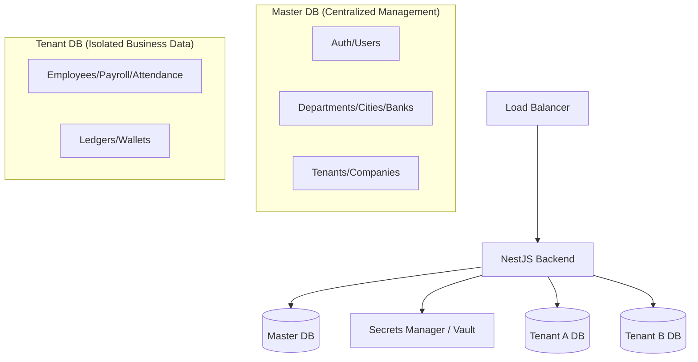

# Production-Ready Multi-Tenant Architecture (Redesigned)

This documentation defines the new production-ready architecture for the Speed Limit project.

## 1. System Components



## 2. Detailed Data Ownership

### Master Database Tables
| Category | Tables |
| :--- | :--- |
| **Identity** | `User`, `Role`, `Permission`, `Session`, `RefreshToken`, `ActivityLog` |
| **Tenancy** | `Tenant`, `Company` |
| **HRM Structure** | `Department`, `SubDepartment`, `Designation`, `Grade`, `Status` |
| **Global Masters** | `Country`, `State`, `City`, `Bank`, `Holiday`, `Currency` |

### Tenant Database Tables
| Category | Tables |
| :--- | :--- |
| **Transaction HR** | `Employee`, `Attendance`, `LeaveApplication`, `AdvanceSalary`, `Increment`, `Bonus` |
| **Payroll** | `Payroll`, `Allowance`, `Deduction`, `EobiContribution`, `ProvidentFund` |
| **Finance** | `Expenses`, `Ledgers`, `Transactions`, `Wallets`, `PFWithdrawals` |

## 3. Safe Dynamic Connections

The backend uses a **Dynamic Factory** to manage tenant connections:

1.  **Request Arrival**: Middleware extracts `company_code`.
2.  **Secret Resolution**: 
    - Check internal **Secure Cache**.
    - If miss: Request secret from **Vault** (Token -> Vault -> Decrypted Credentials).
3.  **Connection Pooling**:
    - The `username` and `password` are injected into a connection pool.
    - Application uses a request-scoped Prisma Client instance.

### Security Best Practices for Credentials
- **Avoid DB Storage**: Even encrypted DB storage is risky if the DB is compromised.
- **Least Privilege**: Each tenant DB user should only have permissions for their specific database.
- **Rotation**: Vault allows automatic password rotation without updating application code.

## 4. Cross-DB Data Integration Logic

Since Joins are not possible, the application layer handles mapping:

```typescript
// Example Implementation Logic
async function getEmployeeWithDetails(id: string) {
  // 1. Fetch from Tenant DB (Transaction)
  const employee = await this.prismaTenant.employee.findUnique({ where: { id } });
  
  // 2. Resolve references from Master DB (Global)
  const department = await this.prismaMaster.department.findUnique({ 
    where: { id: employee.departmentId } 
  });
  
  return { ...employee, department };
}
```

## 5. Trade-offs

- **Performance**: Fetching from two databases adds latency (mitigate with Redis caching).
- **Maintenance**: Two Prisma clients (`@prisma/master-client` and `@prisma/tenant-client`) must be maintained.
- **Reporting**: Cross-tenant or aggregated reporting requires a dedicated Data Warehouse or complex aggregation logic.
