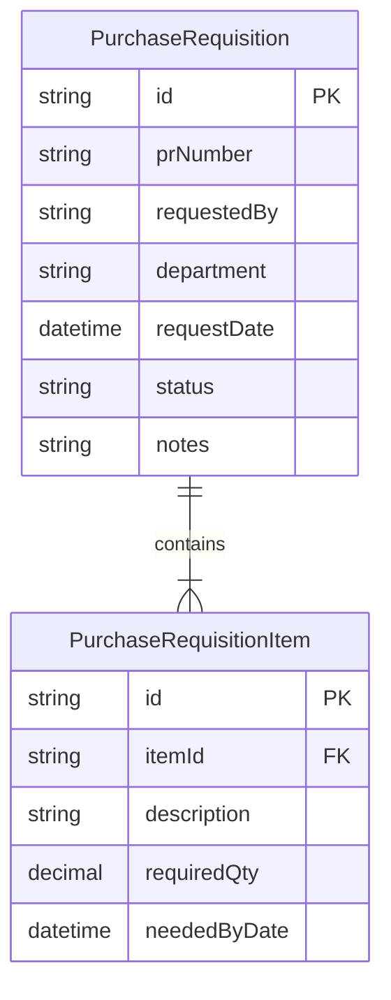
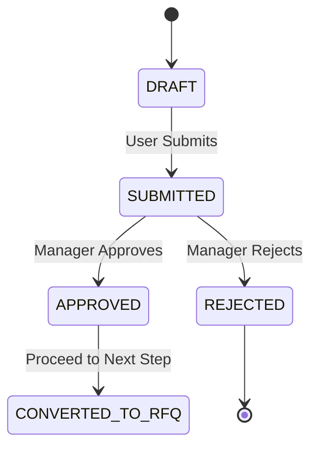
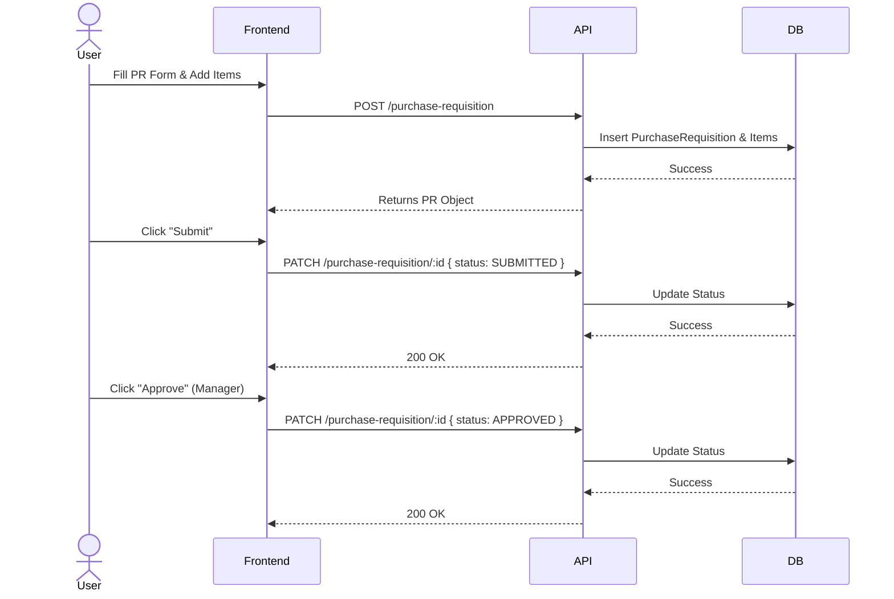

# Purchase Requisition Module

## Overview
The Purchase Requisition (PR) module is the first step in the procurement cycle. It allows employees or departments to request items for purchase. A PR is an internal document and does not represent a commitment to a vendor.

## Procurement Cycle Context
1.  **Purchase Requisition (PR)**: Internal request for items. (Implemented)
2.  **Request for Quotation (RFQ)**: Sent to vendors based on PR. (Future)
3.  **Vendor Quotation**: Prices received from vendors. (Future)
4.  **Purchase Order (PO)**: Official order to a vendor. (Future)
5.  **Goods Received Note (GRN)**: Items received in warehouse. (Future)

## Features
-   **Create PR**: Users can create a draft requisition with multiple items.
-   **Edit PR**: Only `DRAFT` requisitions can be edited.
-   **Workflow**: Submit -> Approve / Reject.
-   **Status Tracking**: Track the status of each requisition.

## API Endpoints

| Method | Endpoint | Description |
| :--- | :--- | :--- |
| `POST` | `/purchase-requisition` | Create a new DRAFT PR |
| `GET` | `/purchase-requisition` | List all PRs (supports `?status=FILTER`) |
| `GET` | `/purchase-requisition/:id` | Get details of a specific PR |
| `PATCH` | `/purchase-requisition/:id` | Update a PR or change status |
| `DELETE`| `/purchase-requisition/:id` | Delete a DRAFT PR |

## Data Model

### ER Diagram

## Workflow Status

The Purchase Requisition follows a strict status flow:

## Sequence Diagram (Create & Approve)

## Future Work
-   **Convert to RFQ**: Implement an action to generate an RFQ from an APPROVED PR.
-   **Item Selection**: Integrate with Master Item API for easier item selection.
-   **User Auth**: Automatically set `requestedBy` based on logged-in user.
