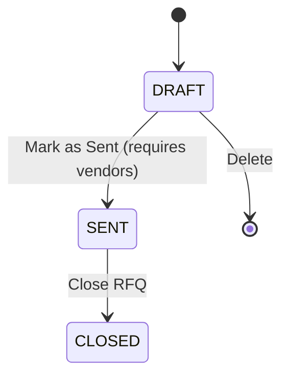
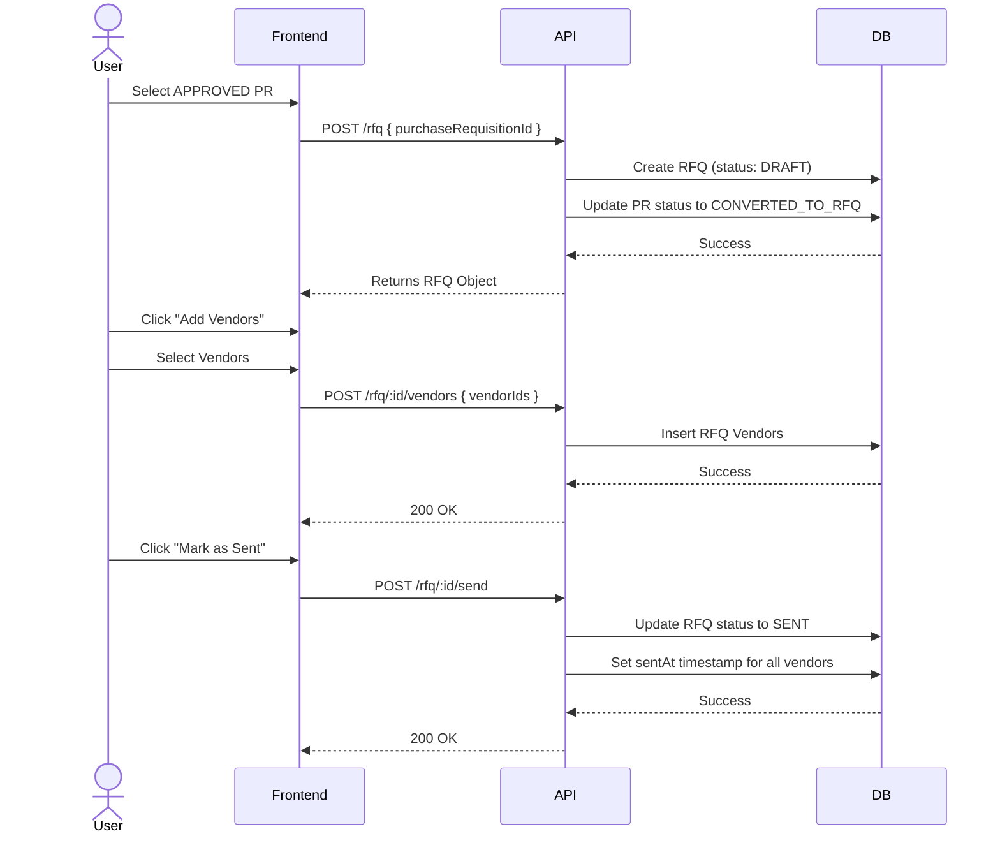

# Request For Quotation (RFQ) Module

## Overview
The Request For Quotation (RFQ) module is the second step in the procurement cycle. It allows users to send approved Purchase Requisitions to multiple vendors to request price quotations. An RFQ is an internal document that facilitates vendor communication and price comparison.

## Procurement Cycle Context
1.  **Purchase Requisition (PR)**: Internal request for items. ✅ Implemented
2.  **Request for Quotation (RFQ)**: Sent to vendors based on PR. ✅ Implemented
3.  **Vendor Quotation**: Prices received from vendors. (Future)
4.  **Purchase Order (PO)**: Official order to a vendor. (Future)
5.  **Goods Received Note (GRN)**: Items received in warehouse. (Future)

## Features
-   **Create RFQ from Approved PR**: Only APPROVED PRs can be converted to RFQs.
-   **Multi-Vendor Selection**: Send the same RFQ to multiple vendors.
-   **Vendor Management**: Add vendors in DRAFT status, lock vendors when SENT.
-   **Status Tracking**: Track RFQ lifecycle (DRAFT → SENT → CLOSED).
-   **Read-Only Items**: Items come from the linked PR and cannot be modified.

## API Endpoints

| Method | Endpoint | Description |
| :--- | :--- | :--- |
| `POST` | `/rfq` | Create RFQ from APPROVED PR |
| `GET` | `/rfq` | List all RFQs (supports `?status=FILTER`) |
| `GET` | `/rfq/:id` | Get RFQ details with PR items and vendors |
| `POST` | `/rfq/:id/vendors` | Add vendors to DRAFT RFQ |
| `POST` | `/rfq/:id/send` | Mark RFQ as SENT |
| `PATCH` | `/rfq/:id` | Update RFQ notes or status |
| `DELETE`| `/rfq/:id` | Delete a DRAFT RFQ |

## Data Model

### ER Diagram

```mermaid
erDiagram
    RequestForQuotation {
        string id PK
        string rfqNumber
        string purchaseRequisitionId FK
        datetime rfqDate
        string status
        string notes
    }
    RequestForQuotationVendor {
        string id PK
        string rfqId FK
        string vendorId FK
        datetime sentAt
        string responseStatus
    }
    PurchaseRequisition {
        string id PK
        string prNumber
        string status
    }
    Supplier {
        string id PK
        string code
        string name
    }
    
    RequestForQuotation ||--|| PurchaseRequisition : "created from"
    RequestForQuotation ||--|{ RequestForQuotationVendor : contains
    RequestForQuotationVendor }|--|| Supplier : "sent to"
```

## Workflow Status

The RFQ follows a strict status flow:

## Business Rules

1.  **PR Requirement**: RFQ can only be created from an APPROVED PR.
2.  **Status Update**: When RFQ is created, the linked PR status changes to `CONVERTED_TO_RFQ`.
3.  **Vendor Management**:
    -   Vendors can only be added when RFQ is in DRAFT status.
    -   Once marked as SENT, vendors cannot be added or removed.
    -   When marked as SENT, all vendors' `sentAt` timestamp is recorded.
4.  **Items**: RFQ does NOT have its own items. Items are read-only from the linked PR.
5.  **Deletion**: Only DRAFT RFQs can be deleted.

## Sequence Diagram (Create RFQ → Add Vendors → Send)

## Connection to Next Module

Once an RFQ is SENT, vendors can submit their quotations (next module: **Vendor Quotation**). The vendor quotations will reference:
-   The RFQ ID
-   The Vendor ID
-   Prices for each item from the PR

## Future Work
-   **Vendor Quotation Module**: Allow vendors to submit prices for RFQ items.
-   **Email Integration**: Automatically send RFQ details to vendor emails when marked as SENT.
-   **Response Tracking**: Update `responseStatus` when vendors submit quotations.
-   **Comparison View**: Compare vendor quotations side-by-side.
