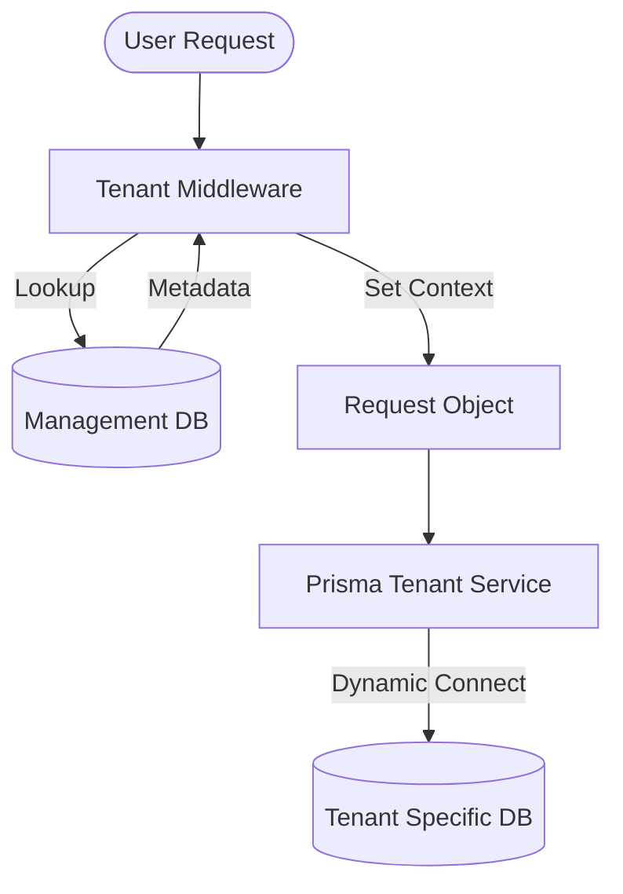

# Tenant and Company Architecture Documentation

This document describes the multi-tenant architecture implemented in the Speed Limit project, covering database isolation, company creation, and request context switching.

## 1. High-Level Overview

The system follows a **Database-per-Tenant** isolation strategy. This ensures maximum data security and performance isolation between different companies.



## 2. Database Layers

### A. Management Layer (Global)
- **Database**: `management` (Primary DB)
- **Schema**: `prisma/management/schema.prisma`
- **Responsibility**: Stores global metadata and routes requests.
- **Tables**:
    - `Tenant`: SaaS customers/organizations.
    - `Company`: Specific entities within a tenant, each mapped to a physical database (`dbName`).

### B. Tenant Layer (Isolated)
- **Database**: Unique database for each company (e.g., `tenant_companycode_timestamp`).
- **Schema**: Defined in `prisma/schema/*.prisma`.
- **Responsibility**: Stores all company-specific data.
- **Key Tables**:
    - **Auth**: `User`, `Role`, `Permission`, `Session`, `RefreshToken`.
    - **HRM**: `Employee`, `Department`, `Designation`, `EmployeeGrade`, `EmployeeStatus`.
    - **Payroll/Finance**: `Payroll`, `AllowanceHead`, `DeductionHead`, `LoanRequest`, `ProvidentFund`, `EOBI`, `TaxSlab`, `RebateNature`.
    - **Attendance**: `Attendance`, `AttendanceExemption`, `WorkingHoursPolicy`, `LeaveApplication`, `LeaveType`, `LeavesPolicy`.
    - **System**: `ActivityLog`, `FileUpload`, `Notification`, `NotificationDeliveryAttempt`.
    - **Master Data**: `Country`, `City`, `State`, `Location`, `Bank`, `Holiday`.

## 3. Automated Company Creation (Provisioning)

When a new company is created via the `/admin/companies` API, the following "scripted" flow occurs in `TenantDatabaseService`:

1.  **Database Name Generation**: A unique name is generated based on the company code and a timestamp.
2.  **Physical DB Creation**: The system executes `CREATE DATABASE` on the PostgreSQL server.
3.  **Schema Migration**: The system programmatically runs Prisma migrations against the new database:
    ```bash
    bunx prisma migrate deploy --config="prisma.tenant.config.ts"
    ```
4.  **Metadata Registration**: The `dbName` and other company details are saved in the Management DB.

## 4. Request Context Switching

The system dynamically switches database connections on every request using `TenantMiddleware`:

1.  **Tenant Identification**: The middleware attempts to find a `tenantId` from:
    - `x-tenant-id` HTTP header.
    - Subdomain (e.g., `apple.speedlimit.com` -> `apple`).
    - Query parameter `tenantId`.
    - User session (if already authenticated).
2.  **Connection String Generation**: It looks up the `dbName` in the Management DB and constructs a full PostgreSQL connection URL.
3.  **Request Injection**: The `tenantId` and `dbUrl` are attached to the Request object.
4.  **Request-Scoped Prisma Client**: The `PrismaTenantService` (scoped to the request) uses the URL from the Request object to initialize a new Prisma instance for that specific request.

## 5. Implementation Files

| Component | File Path |
| :--- | :--- |
| Management Schema | `nestjs_backend/prisma/management/schema.prisma` |
| Tenant Schemas | `nestjs_backend/prisma/schema/*.prisma` |
| Management Service | `nestjs_backend/src/database/prisma-management.service.ts` |
| Tenant Service | `nestjs_backend/src/database/prisma-tenant.service.ts` |
| Provisioning Logic | `nestjs_backend/src/database/tenant-database.service.ts` |
| Context Middleware | `nestjs_backend/src/database/tenant.middleware.ts` |
| Company API | `nestjs_backend/src/admin/company/company.service.ts` |
| Frontend Actions | `frontend/lib/actions/companies.ts` |

## 6. How to Run Migrations

- To migrate the **Management** DB:
  ```bash
  bunx prisma migrate dev --schema=prisma/management/schema.prisma
  ```
- To migrate **All Tenants**:
  The system handles this during provisioning. For global updates, a custom script would be required to iterate through all companies and run `prisma migrate deploy`.
