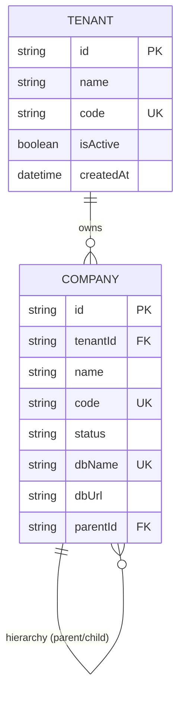
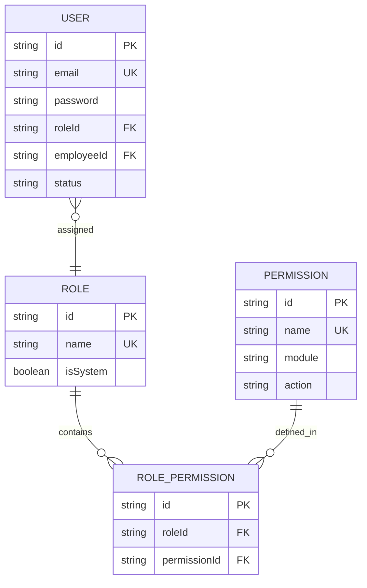
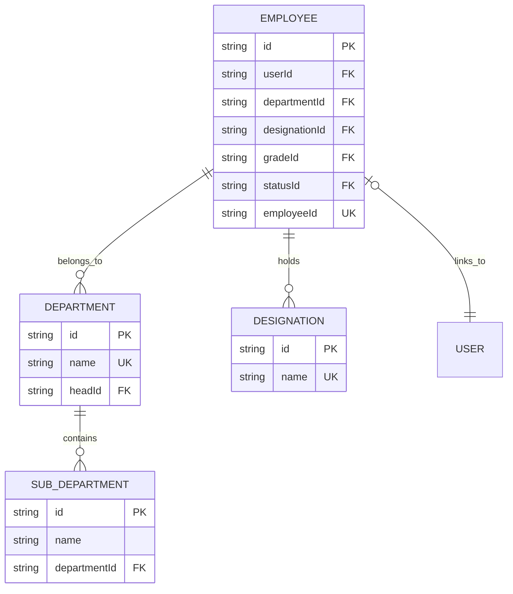

# Tenant and Company ERD Documentation

This document provides a visual representation of the Entity-Relationship Diagram (ERD) for the Speed Limit multi-tenant system.

## 1. Multi-Database Architecture

The system is split into a **Management Database** (Global) and multiple **Tenant Databases** (Isolated).

### Management Database (Global)
This database manages the lifecycle of tenants and their physical storage.

---

### Tenant Database (Company Specific)
Each company has its own isolated database with the following core entities.

#### A. Authentication & Authorization

#### B. HRM & Employee Management

## 2. Cross-Database Relationship

The link between the two layers is **Conceptual/Dynamic**. There are no physical Foreign Keys across databases.

1.  **Management DB** -> Knows which `dbName` to connect to for a specific `Company`.
2.  **Tenant DB** -> Contains the actual `User` and `Employee` data for that company.

| From (Management) | To (Tenant Connection) | Key Link |
| :--- | :--- | :--- |
| `Company.code` | Request Context | Used in `x-tenant-id` header to route requests. |
| `Company.dbName` | Connection String | Used by `PrismaTenantService` to connect. |

## 3. Data Integrity Strategy

- **Management Layer**: Ensures that `Company.code` and `Company.dbName` are unique globally.
- **Tenant Layer**: Ensures that items like `User.email` and `Employee.employeeId` are unique within that specific company's database.
