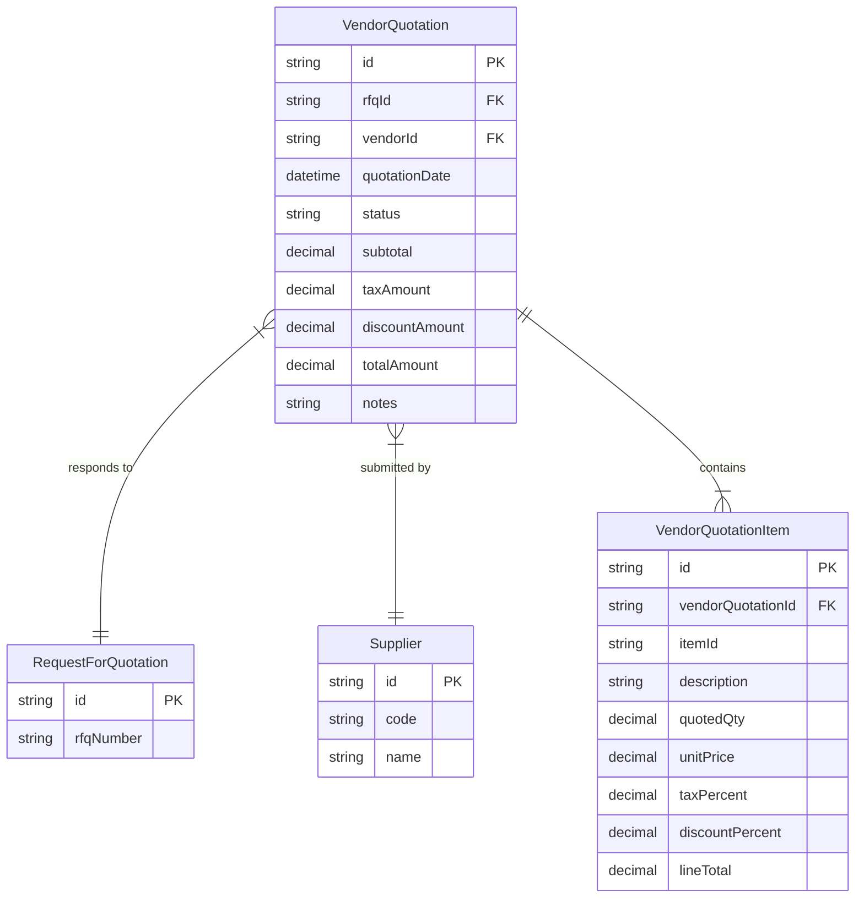
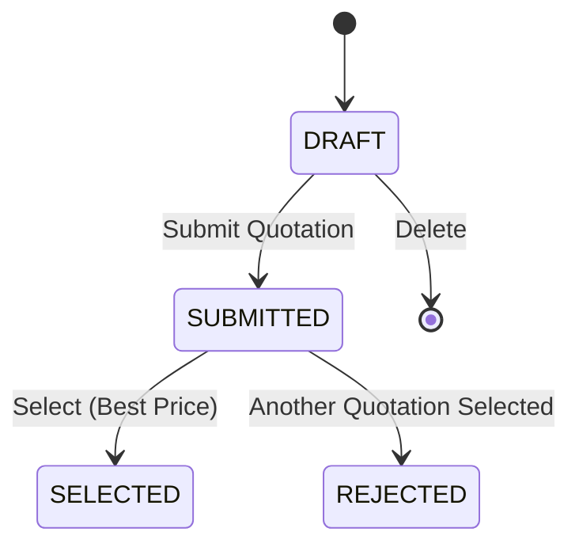
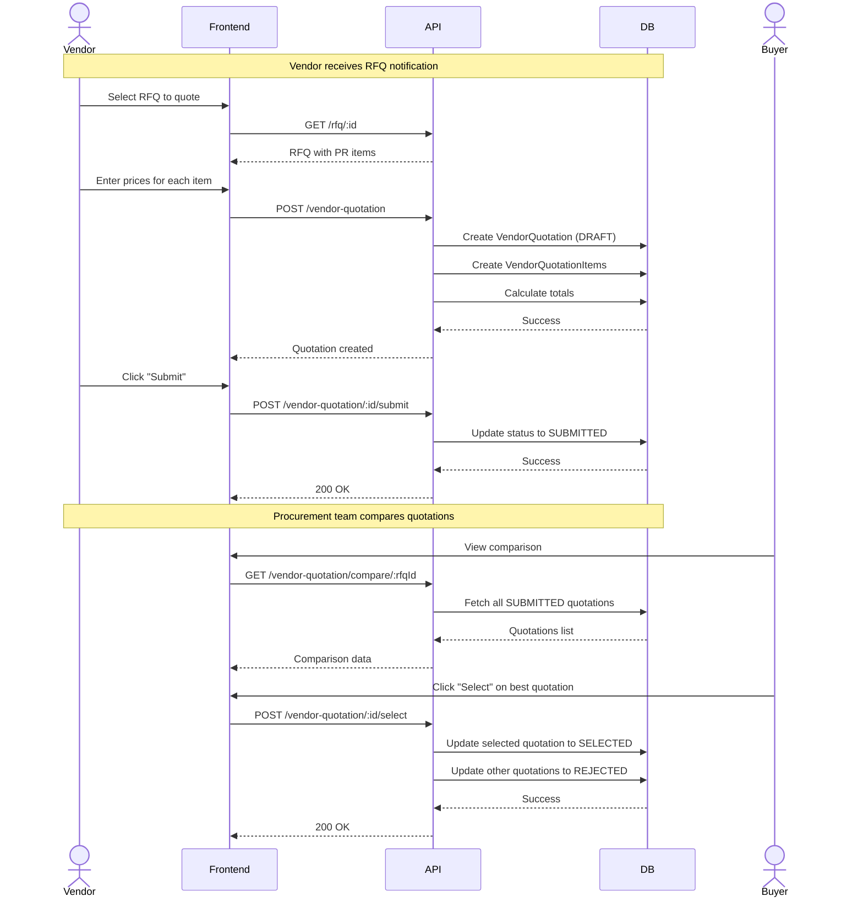

# Vendor Quotation Module

## Overview
The Vendor Quotation module is the third step in the procurement cycle. It allows vendors to submit price quotations in response to RFQs, enables price comparison between vendors, and facilitates the selection of the best quotation for purchase order generation.

## Procurement Cycle Context
1.  **Purchase Requisition (PR)**: Internal request for items. ✅ Implemented
2.  **Request for Quotation (RFQ)**: Sent to vendors based on PR. ✅ Implemented
3.  **Vendor Quotation**: Prices received from vendors. ✅ Implemented
4.  **Purchase Order (PO)**: Official order to a vendor. (Future)
5.  **Goods Received Note (GRN)**: Items received in warehouse. (Future)

## Features
-   **Create Quotations**: Vendors (or procurement team) can create quotations for RFQs.
-   **Item-Level Pricing**: Enter unit price, tax percentage, and discount percentage for each item.
-   **Automatic Calculations**: System automatically calculates line totals, subtotals, tax amounts, discounts, and grand totals.
-   **Price Comparison**: Side-by-side comparison of all submitted quotations for an RFQ.
-   **Quotation Selection**: Select one quotation (automatically rejects others).
-   **Status Tracking**: Track quotation lifecycle (DRAFT → SUBMITTED → SELECTED/REJECTED).

## API Endpoints

| Method | Endpoint | Description |
| :--- | :--- | :--- |
| `POST` | `/vendor-quotation` | Create vendor quotation for RFQ |
| `GET` | `/vendor-quotation` | List all quotations (supports `?rfqId=FILTER`) |
| `GET` | `/vendor-quotation/:id` | Get quotation details |
| `GET` | `/vendor-quotation/compare/:rfqId` | Compare all submitted quotations for RFQ |
| `POST` | `/vendor-quotation/:id/submit` | Submit quotation |
| `POST` | `/vendor-quotation/:id/select` | Select quotation (rejects others) |
| `PATCH` | `/vendor-quotation/:id` | Update quotation |
| `DELETE`| `/vendor-quotation/:id` | Delete DRAFT quotation |

## Data Model

### ER Diagram

## Workflow Status

The Vendor Quotation follows a strict status flow:

## Business Rules

1.  **Vendor Validation**: Only vendors that are part of the RFQ can create quotations.
2.  **Unique Quotation**: Each vendor can only have one quotation per RFQ.
3.  **Item Matching**: Quotation items must match the items from the linked PR (via RFQ).
4.  **Automatic Calculations**:
    -   Line Total = (Qty × Unit Price) - Discount + Tax
    -   Discount Amount = (Qty × Unit Price) × (Discount % / 100)
    -   Tax Amount = (After Discount) × (Tax % / 100)
    -   Subtotal = Sum of all (Qty × Unit Price)
    -   Grand Total = Subtotal - Total Discount + Total Tax
5.  **Selection Logic**:
    -   Only SUBMITTED quotations can be selected.
    -   When one quotation is SELECTED, all other SUBMITTED quotations for the same RFQ become REJECTED.
6.  **Editing**: Only DRAFT quotations can be edited or deleted.

## Price Comparison

The comparison feature displays all submitted quotations side-by-side:
-   **Item-wise comparison**: Shows unit price, tax, discount, and line total for each item across all vendors.
-   **Total comparison**: Displays subtotal, tax amount, discount amount, and grand total for each vendor.
-   **Visual indicators**: Highlights the lowest price and selected quotation.
-   **Selection action**: Allows selecting the best quotation directly from the comparison view.

## Sequence Diagram (RFQ → Quotation → Selection)

## Connection to Next Module

Once a quotation is SELECTED, it can be used to generate a **Purchase Order (PO)**. The PO will:
-   Reference the selected quotation
-   Use the vendor from the quotation
-   Include items with the agreed prices
-   Serve as the official order document

## Calculation Examples

### Example 1: Simple Item
- Quantity: 10
- Unit Price: $100
- Tax: 0%
- Discount: 0%
- **Line Total**: 10 × $100 = **$1,000**

### Example 2: With Tax
- Quantity: 5
- Unit Price: $200
- Tax: 10%
- Discount: 0%
- Subtotal: 5 × $200 = $1,000
- Tax Amount: $1,000 × 10% = $100
- **Line Total**: $1,000 + $100 = **$1,100**

### Example 3: With Discount and Tax
- Quantity: 20
- Unit Price: $50
- Tax: 5%
- Discount: 10%
- Subtotal: 20 × $50 = $1,000
- Discount Amount: $1,000 × 10% = $100
- After Discount: $1,000 - $100 = $900
- Tax Amount: $900 × 5% = $45
- **Line Total**: $900 + $45 = **$945**

## Future Work
-   **Email Notifications**: Notify vendors when RFQ is sent and when quotation is selected/rejected.
-   **Quotation Validity**: Add validity period for quotations.
-   **Partial Selection**: Allow selecting different vendors for different items.
-   **Negotiation**: Add negotiation rounds with counter-offers.
-   **Vendor Portal**: Self-service portal for vendors to submit quotations.
